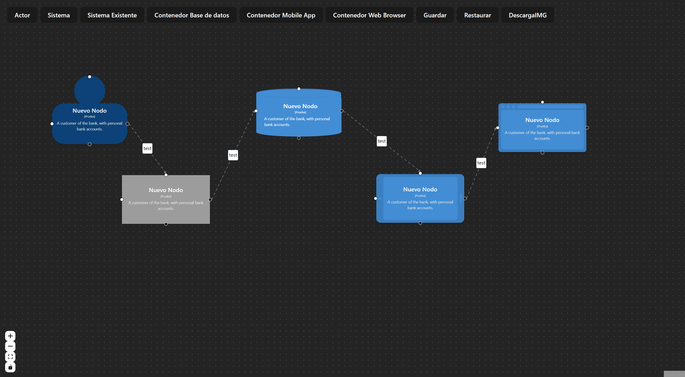

# Editor de Modelo C4 utilizando React con Vite y React Flow

Este repositorio contiene un Editor de Modelo C4 construido con React y React Flow, impulsado por Vite para una experiencia de desarrollo rápida. Hice esto con chatgpt-3.5

[English](./README.md) | [Español](./README.es.md) | [Français](./README.fr.md) | [日本語](./README.jp.md)

## Captura de Pantalla

*Tablero de Instrumentos*

<p align="center">
  
</p>

## Cómo Ejecutar

Para comenzar, sigue estos pasos:

1. **Instalación**: Asegúrate de tener Node.js y npm (Node Package Manager) instalados en tu sistema. Luego, navega al directorio raíz del proyecto y abre una terminal. Ejecuta el siguiente comando para instalar las dependencias necesarias:

    ```sh
    npm install
    ```

2. **Ejecutar Servidor de Desarrollo**: Después de que la instalación esté completa, puedes iniciar el servidor de desarrollo usando el siguiente comando:

    ```sh
    npm run dev
    ```

    Este comando iniciará el servidor de desarrollo usando Vite. Verás la salida en la terminal indicando que el servidor está en ejecución. Abre tu navegador web y navega a la URL proporcionada (generalmente http://localhost:3000) para acceder a la aplicación del Editor de Modelo C4.

## Acerca del Editor de Modelo C4

El Editor de Modelo C4 en este repositorio está construido con React y React Flow. El modelo C4 es una notación visual para documentar arquitecturas de software. Proporciona una forma de representar diferentes niveles de abstracción de manera clara y concisa, facilitando la comunicación y comprensión de la estructura de un sistema de software.

## Estructura del Proyecto

La estructura del proyecto está organizada de la siguiente manera:

- `src/`: Este directorio contiene el código fuente de la aplicación del Editor de Modelo C4.
  - `components/`: Contiene componentes React utilizados para construir la interfaz de usuario de la aplicación y se utiliza para visualizar y manipular los diagramas del modelo C4.

  - `App.js`: El componente principal de la aplicación donde se define la estructura general.
  - `index.js`: El punto de entrada de la aplicación.
- `public/`: Este directorio contiene activos estáticos que serán servidos tal como están por el servidor de desarrollo.

## Contribuir

Si deseas contribuir a este proyecto, siéntete libre de bifurcar el repositorio, hacer tus cambios y enviar un pull request. Asegúrate de seguir las mejores prácticas y mantener los estándares de codificación del proyecto.

## Licencia

Este proyecto está bajo la [Licencia MIT](LICENSE). Asegúrate de revisar y entender los términos de la licencia antes de usar o contribuir al proyecto.

---

¡Feliz codificación! 🚀
